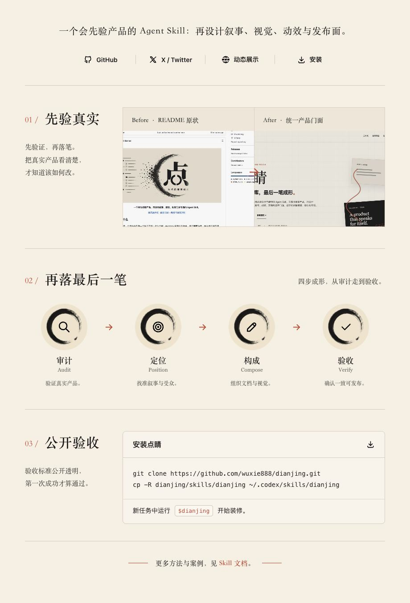

<div align="center">
  <a href="https://wuxie888.github.io/dianjing/">
    
  </a>
  <br>
  
</div>

<details>
  <summary><b>入口、安装与完整说明</b></summary>
  <br>

  [GitHub](https://github.com/wuxie888/dianjing)
  &nbsp;&nbsp;&nbsp;&nbsp;
  [X / Twitter](https://x.com/sciencedegens)
  &nbsp;&nbsp;&nbsp;&nbsp;
  [动态展示](https://wuxie888.github.io/dianjing/)
  &nbsp;&nbsp;&nbsp;&nbsp;
  [阅读 Skill](./skills/dianjing/SKILL.md)

  ### 安装

  ```bash
  git clone https://github.com/wuxie888/dianjing.git
  mkdir -p ~/.codex/skills
  cp -R dianjing/skills/dianjing ~/.codex/skills/dianjing
  ```

  重新开启任务后，进入要装修的仓库并告诉 Agent：

  ```text
  使用 $dianjing 装修这个代码库。
  先核验真实产品和仓库状态，再完成 README、真实视觉、动效与发布验收。
  ```

  第一次成功的标志：点睛先返回仓库边界、产品事实、可用素材、发布状态和采用模块。在事实确认前，不直接编写漂亮但失真的 README。

  ### 工作方式

  点睛按照 **Audit → Position → Compose → Verify** 工作：

  1. 审计真实产品、仓库边界、许可证、发布状态和现有素材
  2. 明确产品定位、受众、主要动作和需要采用的装修模块
  3. 组织 README、Logo、Hero、截图、动效、文档与发布门面
  4. 分别验收本地实现、远端源码和公开页面

  定位、README、安装、真实素材、许可证、发布状态和基础验收是必做底座。动态 Hero、操作 GIF、视频、展示网站、Social Preview、Release 媒体、双语入口和深度文档按产品需要采用；展示网站不是固定交付。

  ### 只运行只读仓库审计

  ```bash
  python3 skills/dianjing/scripts/audit_repository.py /path/to/repository
  ```

  审计会检查 Git 边界、发布与文档表面、视觉媒体、可能的本机路径、占位文案和敏感文件名，并明确区分 **tracked** 与 **local-only** 资产。

  ### 项目结构与本地验证

  ```text
  dianjing/
  ├── skills/dianjing/       # 可安装的 Skill 本体
  ├── site/                  # 条件性展示网站，也是点睛的自举案例
  ├── assets/                # README 品牌与真实视觉素材
  └── .github/workflows/     # 自动验证与 Pages 发布
  ```

  ```bash
  python3 -m unittest discover \
    -s skills/dianjing/scripts \
    -p 'test_*.py'

  python3 skills/dianjing/scripts/audit_repository.py .
  ```

  [视觉与动效准则](./skills/dianjing/references/visual-and-motion.md)
  &nbsp;&nbsp;&nbsp;&nbsp;
  [验证工作流](https://github.com/wuxie888/dianjing/actions/workflows/validate.yml)
  &nbsp;&nbsp;&nbsp;&nbsp;
  [MIT License](./LICENSE)
</details>
