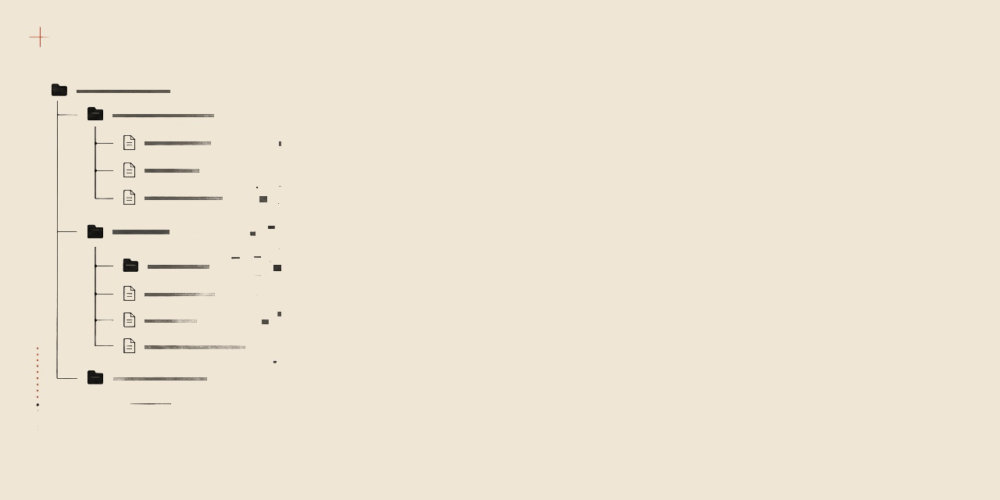
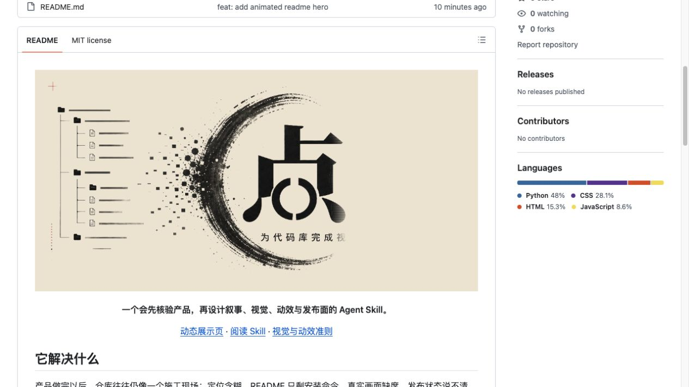
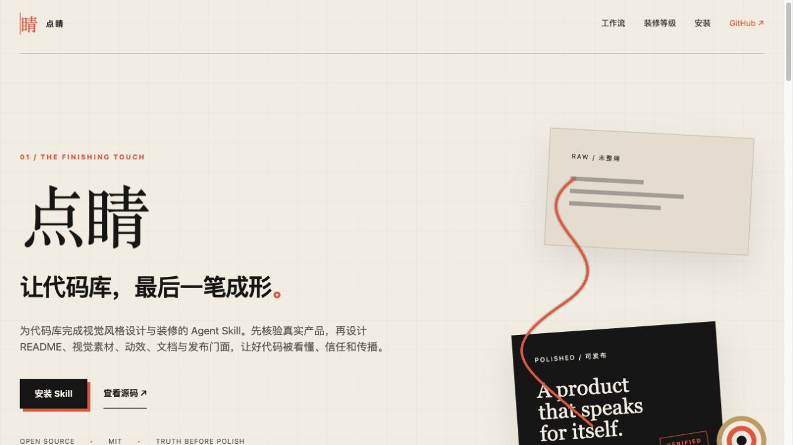

<p align="center">
  <a href="https://wuxie888.github.io/dianjing/">
    
  </a>
</p>

<p align="center">
  <strong>一个会先验产品，再设计叙事、视觉、动效与发布面的 Agent Skill。</strong>
</p>

<table width="100%">
  <tr>
    <td align="center" width="25%">
      <a href="https://github.com/wuxie888/dianjing">
        <br>
        <strong>GitHub</strong>
      </a>
    </td>
    <td align="center" width="25%">
      <a href="https://x.com/sciencedegens">
        <br>
        <strong>X / Twitter</strong>
      </a>
    </td>
    <td align="center" width="25%">
      <a href="https://wuxie888.github.io/dianjing/">
        <br>
        <strong>动态展示</strong>
      </a>
    </td>
    <td align="center" width="25%">
      <a href="#03--公开验收">
        <br>
        <strong>安装</strong>
      </a>
    </td>
  </tr>
</table>

<br>

## <sub>01 /</sub> 先验真实

先验证，再落笔。把真实产品看清楚，才知道该如何改。

| Before · README 原状 | After · 统一产品门面 |
| :---: | :---: |
| [](./assets/readme/canvas/before.jpg) | [](https://wuxie888.github.io/dianjing/) |

<br>

## <sub>02 /</sub> 再落最后一笔

四步成形，从审计走到验收。每一步都是可执行、可检查的真实流程。

<table width="100%">
  <tr>
    <td align="center" width="22%">
      <br>
      <strong>审计</strong><br>
      <sub>Audit</sub><br><br>
      验证真实产品
    </td>
    <td align="center" width="4%">
      
    </td>
    <td align="center" width="22%">
      <br>
      <strong>定位</strong><br>
      <sub>Position</sub><br><br>
      找准叙事与受众
    </td>
    <td align="center" width="4%">
      
    </td>
    <td align="center" width="22%">
      <br>
      <strong>构成</strong><br>
      <sub>Compose</sub><br><br>
      组织文档与视觉
    </td>
    <td align="center" width="4%">
      
    </td>
    <td align="center" width="22%">
      <br>
      <strong>验收</strong><br>
      <sub>Verify</sub><br><br>
      确认一致可发布
    </td>
  </tr>
</table>

点睛先确认源码、运行状态、许可证、发布渠道与真实素材，再决定 README、Logo、Hero、截图、GIF、视频、展示网站、上手与排错文档哪些真正有必要。

<br>

## <sub>03 /</sub> 公开验收

验收标准公开透明，第一次成功才算通过。

### 安装点睛

```bash
git clone https://github.com/wuxie888/dianjing.git
mkdir -p ~/.codex/skills
cp -R dianjing/skills/dianjing ~/.codex/skills/dianjing
```

重新开启任务后，进入要装修的仓库并告诉 Agent：

```text
使用 $dianjing 装修这个代码库。
先核验真实产品和仓库状态，再完成 README、真实视觉、动效与发布验收。
```

> **第一次成功的标志**
>
> 点睛先返回仓库边界、产品事实、可用素材、发布状态和采用模块。在事实确认前，不直接编写漂亮但失真的 README。

<details>
  <summary><b>工作边界、只读审计与本地验证</b></summary>
  <br>

  定位、README、安装、真实素材、许可证、发布状态和基础验收是必做底座。动态 Hero、操作 GIF、视频、展示网站、Social Preview、Release 媒体、双语入口和深度文档按产品需要采用；展示网站不是固定交付。

  **只运行只读仓库审计**

  ```bash
  python3 skills/dianjing/scripts/audit_repository.py /path/to/repository
  ```

  审计会检查 Git 边界、发布与文档表面、视觉媒体、可能的本机路径、占位文案和敏感文件名，并明确区分 **tracked** 与 **local-only** 资产。

  **本地验证**

  ```bash
  python3 -m unittest discover \
    -s skills/dianjing/scripts \
    -p 'test_*.py'

  python3 skills/dianjing/scripts/audit_repository.py .
  ```
</details>

<p align="center">
  <a href="./skills/dianjing/SKILL.md">阅读 Skill</a>
  &nbsp;&nbsp;·&nbsp;&nbsp;
  <a href="./skills/dianjing/references/visual-and-motion.md">视觉与动效准则</a>
  &nbsp;&nbsp;·&nbsp;&nbsp;
  <a href="https://github.com/wuxie888/dianjing/actions/workflows/validate.yml">验证工作流</a>
  &nbsp;&nbsp;·&nbsp;&nbsp;
  <a href="./LICENSE">MIT License</a>
</p>
