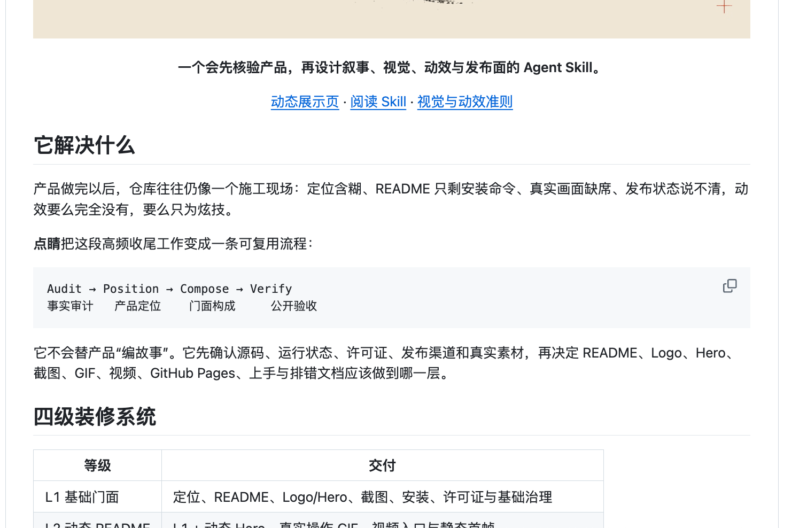
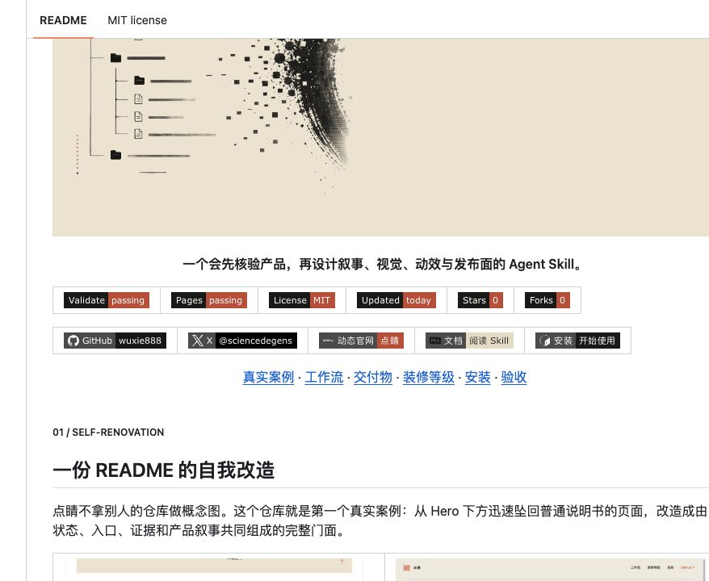
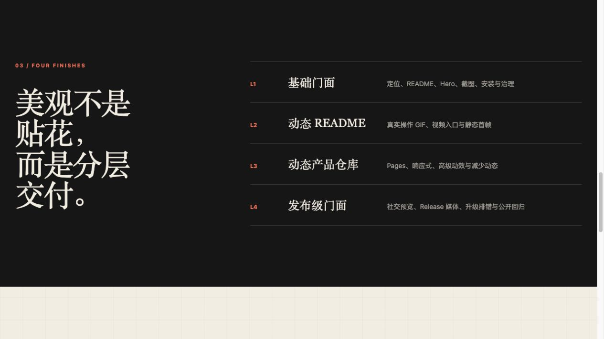
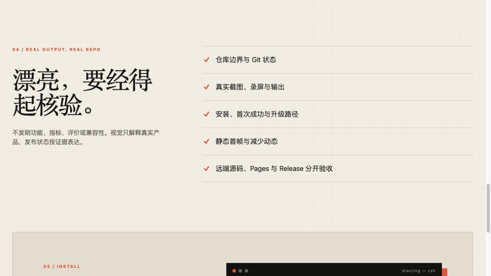
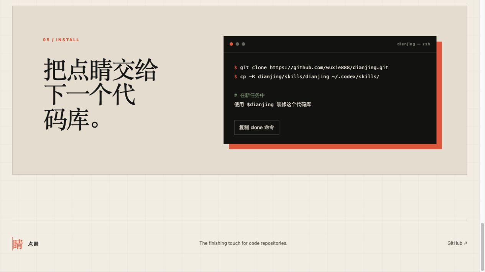

<p align="center">
  
</p>

<p align="center">
  <strong>一个会先核验产品，再设计叙事、视觉、动效与发布面的 Agent Skill。</strong>
</p>

<table>
  <tr>
    <td align="center"><a href="https://github.com/wuxie888/dianjing/actions/workflows/validate.yml"></a></td>
    <td align="center"><a href="https://github.com/wuxie888/dianjing/actions/workflows/pages.yml"></a></td>
    <td align="center"><a href="./LICENSE"></a></td>
    <td align="center"><a href="https://github.com/wuxie888/dianjing/commits/main"></a></td>
    <td align="center"><a href="https://github.com/wuxie888/dianjing/stargazers"></a></td>
    <td align="center"><a href="https://github.com/wuxie888/dianjing/forks"></a></td>
  </tr>
</table>

<table>
  <tr>
    <td align="center"><a href="https://github.com/wuxie888"></a></td>
    <td align="center"><a href="https://x.com/sciencedegens"></a></td>
    <td align="center"><a href="https://wuxie888.github.io/dianjing/"></a></td>
    <td align="center"><a href="./skills/dianjing/SKILL.md"></a></td>
    <td align="center"><a href="#安装与第一次成功"></a></td>
  </tr>
</table>

<p align="center">
  <a href="#一份-readme-的自我改造">真实案例</a>
  ·
  <a href="#四步成形">工作流</a>
  ·
  <a href="#一次交付完整上线">交付物</a>
  ·
  <a href="#四个层级按需选择">装修等级</a>
  ·
  <a href="#安装与第一次成功">安装</a>
  ·
  <a href="#所有设计皆可追溯">验收</a>
</p>

<br>

<p><sub><b>01 / SELF-RENOVATION</b></sub></p>

## 一份 README 的自我改造

点睛不拿别人的仓库做概念图。这个仓库就是第一个真实案例：从 Hero 下方迅速坠回普通说明书的页面，改造成由状态、入口、证据和产品叙事共同组成的完整门面。

<table>
  <tr>
    <td width="50%" valign="top">
      
      <br>
      <sub><b>BEFORE · 施工现场</b><br>有说明，但没有连续的视觉节奏、状态入口和真实案例。</sub>
    </td>
    <td width="50%" valign="top">
      <a href="https://github.com/wuxie888/dianjing">
        
      </a>
      <br>
      <sub><b>AFTER · 点睛成品</b><br>状态、入口、真实案例与品牌视觉从 Hero 后继续生长。</sub>
    </td>
  </tr>
</table>

> **不是把 README 画漂亮，而是让仓库从第一眼到第一次成功都讲同一件事。**

<br>

<p><sub><b>02 / THE DIANJING PROCESS</b></sub></p>

## 四步成形

<a href="./skills/dianjing/SKILL.md">
  
</a>

| 01 · Audit 事实审计 | 02 · Position 产品定位 | 03 · Compose 门面构成 | 04 · Verify 公开验收 |
| --- | --- | --- | --- |
| 找到真实仓库、运行状态、许可证与素材边界 | 说清用户、价值、产品完成度与交付目标 | 组织 README、Hero、截图、动效、文档与 Pages | 检查链接、安装、移动端、减少动态、CI 与公开产物 |

点睛不会替产品“编故事”。它先确认事实，再决定这个仓库应该装修到哪一层。

<br>

<p><sub><b>03 / DELIVERABLES</b></sub></p>

## 一次交付，完整上线

<table>
  <tr>
    <td width="50%" valign="top">
      <a href="https://wuxie888.github.io/dianjing/"></a>
      <br><sub><b>产品首页</b> · 定位、品牌和主叙事</sub>
    </td>
    <td width="50%" valign="top">
      
      <br><sub><b>装修系统</b> · 从基础门面到发布级产品仓库</sub>
    </td>
  </tr>
  <tr>
    <td width="50%" valign="top">
      
      <br><sub><b>公开验收</b> · 真实状态按证据表达</sub>
    </td>
    <td width="50%" valign="top">
      
      <br><sub><b>首次成功</b> · 从安装到真正开始装修</sub>
    </td>
  </tr>
</table>

每次装修按真实需要组合以下交付，而不是机械堆满：

| 叙事与文档 | 视觉与动效 | 发布与传播 | 验收与治理 |
| --- | --- | --- | --- |
| 定位、README、安装、上手、排错 | Logo、Hero、截图、GIF、视频、静态首帧 | Social Preview、Pages、Release 媒体、双语入口 | 仓库边界、许可证、链接、CI、移动端、公开回归 |

<br>

<p><sub><b>04 / RENOVATION LEVELS</b></sub></p>

## 四个层级，按需选择


| 等级 | 适合 | 交付边界 |
| --- | --- | --- |
| **L1 · 基础门面** | 刚开始公开的项目 | 定位、README、Logo/Hero、截图、安装、许可证与基础治理 |
| **L2 · 动态 README** | 已有真实产品画面的项目 | L1 + 动态 Hero、真实操作 GIF、视频入口与静态首帧 |
| **L3 · 动态产品仓库** | 需要完整展示体验的项目 | L2 + GitHub Pages、响应式、高级动效与减少动态 |
| **L4 · 发布级门面** | 正式发布和持续传播的项目 | L3 + Social Preview、Release 媒体、双语入口、升级排错与公开回归 |

<br>

<p><sub><b>05 / INSTALL & FIRST SUCCESS</b></sub></p>

## 安装与第一次成功

### 1. 安装 Skill

```bash
git clone https://github.com/wuxie888/dianjing.git
mkdir -p ~/.codex/skills
cp -R dianjing/skills/dianjing ~/.codex/skills/dianjing
```

### 2. 进入要装修的仓库

```bash
cd /path/to/your-repository
```

### 3. 在新任务中启动点睛

```text
使用 $dianjing 装修这个代码库。
先核验真实产品和仓库状态，再给出适合的装修层级与实施方案。
```

**第一次成功的标志：** 点睛先返回仓库边界、产品事实、可用素材、发布状态和建议装修层级；在这些事实确认之前，不会直接编写漂亮但失真的 README。

<details>
  <summary><b>只运行只读仓库审计</b></summary>
  <br>

  ```bash
  python3 skills/dianjing/scripts/audit_repository.py /path/to/repository
  ```

  它会检查 Git 边界、发布与文档表面、视觉媒体、可能的本机路径、占位文案和敏感文件名，并区分 <b>tracked</b> 与 <b>local-only</b> 资产。
</details>

<br>

<p><sub><b>06 / VERIFICATION & PROVENANCE</b></sub></p>

## 所有设计，皆可追溯


- **源码依据**：不虚构功能、指标、评价、兼容性或发布状态
- **过程留痕**：定位、视觉选择、动效判断和验收结论都有来源
- **真实媒体**：产品截图、GIF 和视频必须来自可核验的运行画面
- **可复现命令**：安装、测试、构建和发布路径可以重新执行
- **公开回归**：本地成功、CI 成功、公开页面和版本发布分别验收

```bash
python3 -m unittest discover \
  -s skills/dianjing/scripts \
  -p 'test_*.py'

python3 skills/dianjing/scripts/audit_repository.py .
```

<br>

---

<p align="center">
  <strong>点睛 · 让代码库，最后一笔成形。</strong>
</p>

<p align="center">
  <sub>OPEN SOURCE &nbsp;·&nbsp; MIT &nbsp;·&nbsp; TRUTH BEFORE POLISH</sub>
</p>
