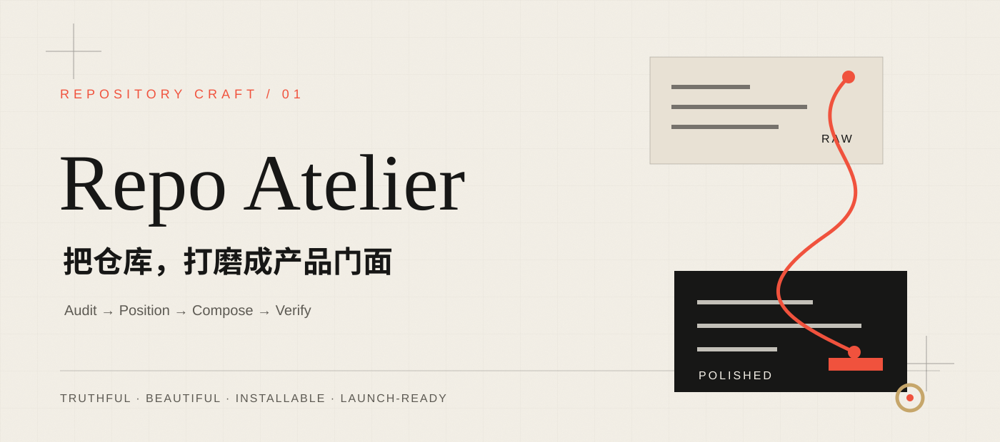

<p align="center">
  
</p>

<p align="center">
  <strong>一个会先核验产品，再设计叙事、视觉、动效与发布面的 Agent Skill。</strong>
</p>

<p align="center">
  <a href="https://wuxie888.github.io/repo-atelier/">动态展示页</a>
  ·
  <a href="./skills/repo-atelier/SKILL.md">阅读 Skill</a>
  ·
  <a href="./skills/repo-atelier/references/visual-and-motion.md">视觉与动效准则</a>
</p>

## 它解决什么

产品做完以后，仓库往往仍像一个施工现场：定位含糊、README 只剩安装命令、真实画面缺席、发布状态说不清，动效要么完全没有，要么只为炫技。

**Repo Atelier** 把这段高频收尾工作变成一条可复用流程：

```text
Audit → Position → Compose → Verify
事实审计   产品定位    门面构成     公开验收
```

它不会替产品“编故事”。它先确认源码、运行状态、许可证、发布渠道和真实素材，再决定 README、Logo、Hero、截图、GIF、视频、GitHub Pages、上手与排错文档应该做到哪一层。

## 四级装修系统

| 等级 | 交付 |
| --- | --- |
| L1 基础门面 | 定位、README、Logo/Hero、截图、安装、许可证与基础治理 |
| L2 动态 README | L1 + 动态 Hero、真实操作 GIF、视频入口与静态首帧 |
| L3 动态产品仓库 | L2 + GitHub Pages、响应式、高级动效与减少动态 |
| L4 发布级门面 | L3 + Social Preview、Release 媒体、双语入口、升级排错与公开回归 |

## 安装

把 [`skills/repo-atelier`](./skills/repo-atelier) 复制到你的 Agent Skills 目录。以 Codex 为例：

```bash
git clone https://github.com/wuxie888/repo-atelier.git
cp -R repo-atelier/skills/repo-atelier ~/.codex/skills/repo-atelier
```

重新开启任务后可直接说：

```text
使用 $repo-atelier 装修这个产品仓库，
完成定位、README、真实视觉与动效、上手文档和发布验收。
```

## 先审计，再装修

Skill 自带只读仓库审计脚本：

```bash
python3 skills/repo-atelier/scripts/audit_repository.py /path/to/repository
```

它会检查 Git 边界、发布与文档表面、视觉媒体、可能的本机路径、占位文案和敏感文件名，并明确区分 **tracked** 与 **local-only** 资产。

## 为什么它自己长这样

这个仓库是 Repo Atelier 的第一个自举案例：

- README 负责静态、快速、可信地说明能力
- GitHub Pages 承载标题入场、滚动显现、路径绘制和光斑反馈
- 所有关键内容在关闭 JavaScript或开启“减少动态”后仍可读
- 没有虚构指标、评价、产品截图或发布状态
- 动效实现来自可追溯的本地设计资产，并遵守各自的克制与降级规则

完整动态版本见 [wuxie888.github.io/repo-atelier](https://wuxie888.github.io/repo-atelier/)。

## 项目结构

```text
repo-atelier/
├── skills/repo-atelier/   # 可安装的 Skill 本体
├── site/                  # GitHub Pages 动态展示页
├── assets/                # README 品牌素材
└── .github/workflows/     # 自动验证与 Pages 发布
```

## 验证

```bash
python3 -m unittest discover \
  -s skills/repo-atelier/scripts \
  -p 'test_*.py'

python3 skills/repo-atelier/scripts/audit_repository.py .
```

## 许可证

项目主体使用 [MIT License](./LICENSE)。`site/motion/` 中注明来源的动效实现使用 Apache-2.0。
