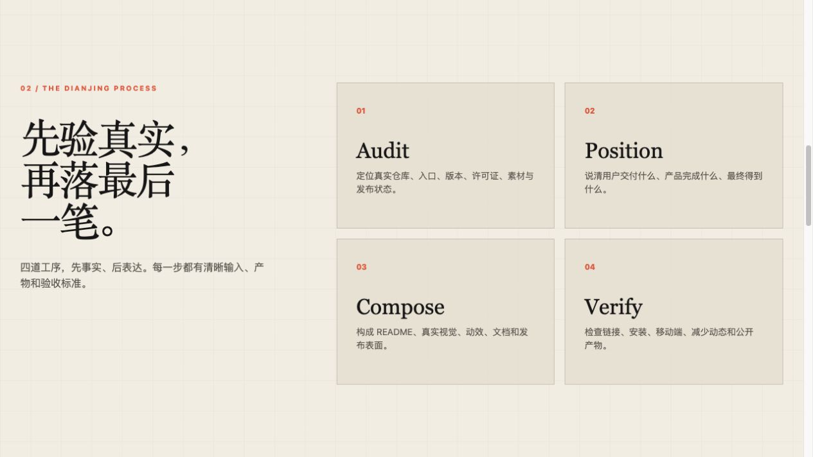

<p align="center">
  
</p>

<p align="center">
  <strong>先核验真实产品，再完成叙事、视觉、动效与发布门面。</strong>
</p>

<p align="center">
  为代码库完成最后一笔的 Agent Skill。
</p>

<p align="center">
  
</p>

<p align="center">
  <a href="https://github.com/wuxie888/dianjing">GitHub</a>
  &nbsp;&nbsp;&nbsp;&nbsp;
  <a href="https://x.com/sciencedegens">X / Twitter</a>
  &nbsp;&nbsp;&nbsp;&nbsp;
  <a href="https://wuxie888.github.io/dianjing/">动态展示</a>
  &nbsp;&nbsp;&nbsp;&nbsp;
  <a href="#安装与第一次成功">安装</a>
</p>

---

## 先验真，再落最后一笔

产品做完以后，仓库往往仍像一个施工现场：定位含糊、README 只剩安装命令、真实画面缺席，发布状态也说不清。

点睛把这段高频收尾工作固定成四道工序：

> **Audit → Position → Compose → Verify**<br>
> 事实审计 → 产品定位 → 门面构成 → 公开验收

它先确认源码、运行状态、许可证、发布渠道和真实素材，再决定 README、Logo、Hero、截图、GIF、视频、展示网站、上手与排错文档哪些真正有必要。

<a href="https://wuxie888.github.io/dianjing/#process">
  
</a>

## 必做底座，按需加模块

所有仓库都先完成定位、README、安装、真实素材、许可证、发布状态和基础验收。其余能力按产品任务选择，不以模块数量区分高低。

| 条件模块 | 什么时候采用 |
| --- | --- |
| **动态表达** | Hero、操作 GIF 或视频能更快解释产品 |
| **展示网站** | README 无法承载关键交互、视觉体验或非开发者转化，且没有可复用官网 |
| **发布传播** | 产品需要 Social Preview、Release 媒体、双语入口或升级排错 |
| **深度文档** | API、配置、安装或维护复杂到 README 已不够用 |

展示网站不是固定交付。Agent Skill、CLI、SDK 和小型库通常以 README 为主页；产品已经有正式官网时直接连接，不再重复造站。

## 安装与第一次成功

```bash
git clone https://github.com/wuxie888/dianjing.git
mkdir -p ~/.codex/skills
cp -R dianjing/skills/dianjing ~/.codex/skills/dianjing
```

重新开启任务后，进入要装修的仓库并告诉 Agent：

```text
使用 $dianjing 装修这个代码库。
先核验真实产品和仓库状态，再完成 README、真实视觉、动效与发布验收。
```

> **第一次成功的标志**<br>
> 点睛先返回仓库边界、产品事实、可用素材、发布状态和采用模块。在事实确认之前，不会直接编写漂亮但失真的 README。

<details>
  <summary><b>只运行只读仓库审计</b></summary>
  <br>

  ```bash
  python3 skills/dianjing/scripts/audit_repository.py /path/to/repository
  ```

  审计会检查 Git 边界、发布与文档表面、视觉媒体、可能的本机路径、占位文案和敏感文件名，并明确区分 <b>tracked</b> 与 <b>local-only</b> 资产。
</details>

## 公开验收

点睛把“本地做完”和“公开生效”分开报告：

- 源码、README 和媒体来自同一份可核验产品
- 安装、第一次成功和升级路径可以重新执行
- GIF 有稳定首帧和自然循环，展示网站支持减少动态
- 远端源码、采用的网站、Tag 和 Release 分别验收
- 未完成、未授权或只经口头确认的部分不会写成已发布

[查看 Skill](./skills/dianjing/SKILL.md)
&nbsp;&nbsp;&nbsp;&nbsp;
[视觉与动效准则](./skills/dianjing/references/visual-and-motion.md)
&nbsp;&nbsp;&nbsp;&nbsp;
[验证工作流](https://github.com/wuxie888/dianjing/actions/workflows/validate.yml)
&nbsp;&nbsp;&nbsp;&nbsp;
[动态展示页](https://wuxie888.github.io/dianjing/)

<details>
  <summary><b>项目结构与本地验证</b></summary>
  <br>

  ```text
  dianjing/
  ├── skills/dianjing/       # 可安装的 Skill 本体
  ├── site/                  # 条件性展示网站，也是点睛的自举案例
  ├── assets/                # README 品牌与真实视觉素材
  └── .github/workflows/     # 自动验证与 Pages 发布
  ```

  ```bash
  python3 -m unittest discover \
    -s skills/dianjing/scripts \
    -p 'test_*.py'

  python3 skills/dianjing/scripts/audit_repository.py .
  ```
</details>

---

<p align="center">
  <strong>点睛，让代码库最后一笔成形。</strong>
</p>

<p align="center">
  <a href="./LICENSE">MIT License</a>
</p>
